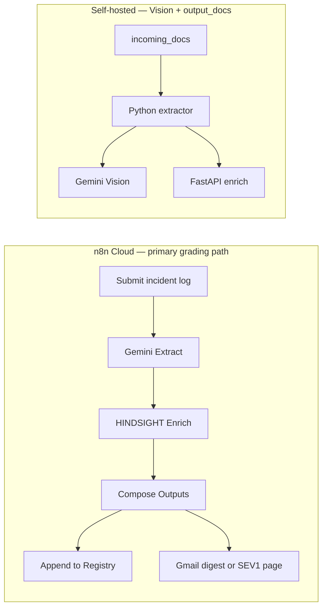

<div align="center">

# HINDSIGHT

### Cyber incident log intelligence

**SIEM exports, vuln scans, and phishing reports → structured, routed, filed automatically.**

`n8n Cloud` · `Gemini 3 Flash (+ Vision)` · `FastAPI` · `Google Sheets` · `Gmail`

</div>

---

## What it does

HINDSIGHT is the **Cybersecurity incident logs** scenario from the n8n homework: upload a
document, Gemini extracts a strict JSON schema, a deterministic enrichment brain re-scores
severity (including **CVSS floor**), classifies **sensitivity**, assigns **routing_tag**, and
files one row per document to Google Sheets plus an HTML Gmail summary.



**The LLM extracts; the service decides.** CVSS 9.8 on a Nessus report floors to SEV1 and
`routing_tag=escalate` even when the author typed SEV3.

---

## n8n Cloud (grading path)

| Item | Value |
|---|---|
| Instance | https://reemmor.app.n8n.cloud |
| Workflow | `HINDSIGHT — Postmortem Intelligence (Cloud)` · id `aYEv22StywIPL3Rq` |
| Registry sheet | `1Z7tiPISHB5siYby_lQnWA9wtXbDXVSGTu4HGZ5Dk2tk` · tab `Incidents` |
| Code nodes | `n8n/cloud/nodes/*.js` (synced via `scripts/sync_n8n_cloud_nodes.py`) |

| Credential | Used by |
|---|---|
| `Google Gemini(PaLM) Api account` | Gemini — Extract Incident |
| `Google Sheets Amdocs Course API` | Append to Registry |
| `Gmail Amdocs course API` | Page On-Call / Postmortem Filed → `reem.mor3@gmail.com` |

**Manual before live run:** activate workflow, verify sheet headers (see [`docs/SETUP-GUIDE.md`](docs/SETUP-GUIDE.md)), submit `samples/vuln_scan_critical_openssl.md` via the form Production URL.

---

## Self-hosted (docker)

```powershell
docker compose up --build -d
```

Drop `.pdf` / `.md` into `incoming_docs/`. Import `n8n/hindsight_workflow.json` into local n8n
or use the compose stack. Vision branch reads embedded SIEM/scan charts; output markdown lands in
`output_docs/`.

---

## FastAPI enrichment API

```powershell
.\.venv\Scripts\python.exe -m pytest services\enrichment-api -q
```

Endpoints: `POST /enrich`, `GET /health`, `GET /categories`, `POST /sensitivity`. SecOps catalog
in `services/enrichment-api/data/service_catalog.yaml`.

---

## Bonus challenges (≥2 required — 4 delivered)

| Bonus | Where | Verified |
|---|---|---|
| **Gemini Vision** | Self-hosted Vision node + cloud PDF `inline_data`; `prompts/vision_prompt.md`; `samples/make_cyber_pdf_sample.py` | Config + extractor image path |
| **Live dashboard** | [`dashboard/index.html`](dashboard/index.html) — severity, CVSS, sensitivity, routing_tag | Sample JSON + optional published Sheet CSV |
| **Retry logic** | Gemini HTTP: 5 tries / 3s backoff; Enrich: 3 tries | `retryOnFail` on workflow nodes |
| **Sensitivity alerting** | SEV1 → high-priority **Page On-Call** email; CVSS ≥ 9 → escalate + page | pytest `test_critical_cvss_*`; node tests |

---

## Tests

```powershell
.\.venv\Scripts\python.exe -m pytest services\enrichment-api -q    # 48 tests
node n8n\cloud\tests\test_node_bodies.mjs                           # 58 checks
.\.venv\Scripts\python.exe scripts\audit_n8n_cloud.py
```

---

## Screenshots

| Artifact | Path |
|---|---|
| n8n workflow canvas | `docs/screenshot-workflow.png` |
| Execution detail | `docs/screenshot-execution.png` |
| Google Sheet row | `docs/screenshot-sheet.png` |
| Gmail notification | `docs/screenshot-email.png` |
| Dashboard | `docs/screenshot-dashboard.png` |
| FastAPI OpenAPI | `docs/screenshot-fastapi.png` |

Regenerate local shots: `node scripts/capture_screenshots.mjs`

---

## Repo map

| Path | Role |
|---|---|
| `n8n/cloud/nodes/` | Live Cloud Code-node bodies (source of truth) |
| `services/enrichment-api/` | Graded FastAPI brain |
| `samples/` | Cyber incident fixtures |
| `docs/SETUP-GUIDE.md` | Manual checklist |
| `docs/traceability-matrix.md` | Requirement mapping |
| `docs/VALIDATION.md` | Evidence trail |

Full setup: [`docs/SETUP-GUIDE.md`](docs/SETUP-GUIDE.md)
