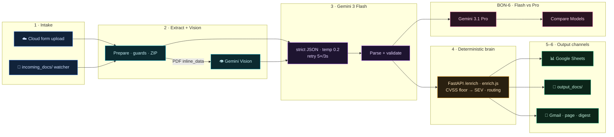
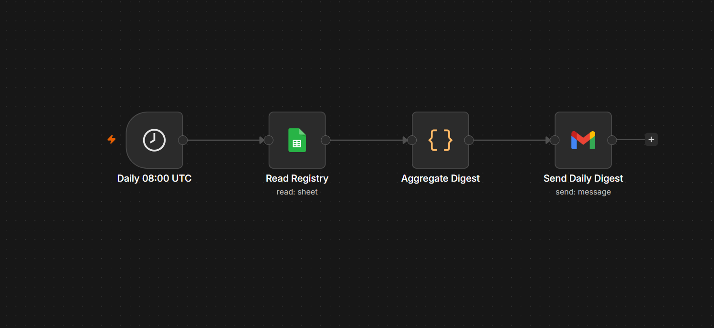

<div align="center">

# HINDSIGHT

### Intelligent Cloud Document Analyst — Cybersecurity Incident Logs

**Enterprise document intelligence pipeline:** n8n · Google Gemini 3 Flash · FastAPI · Google Sheets · Gmail · Supabase pgvector

[](#verification)
[](#technology-stack)
[](#deployment-paths)
[](#technology-stack)
[](#bonus-challenges)

[Architecture](#architecture) · [Quick start](#quick-start) · [Course mapping](#course-requirement-mapping) · [Bonus challenges](#bonus-challenges) · [Docs](#documentation)

**👩‍🏫 Reviewing this project?** → [`docs/REVIEWER-ACCESS.md`](docs/REVIEWER-ACCESS.md) — verify end-to-end with **no login** (public form, importable workflow, local Docker, screenshots).

</div>

---

## Project summary

HINDSIGHT implements the **Cybersecurity incident logs** scenario from the n8n **Intelligent Cloud Document Analyst** course. Students upload SIEM exports, vulnerability scans, phishing reports, or intrusion writeups; **Gemini extracts** structured JSON; a **deterministic enrichment service** re-scores severity (CVSS floor), classifies sensitivity, assigns routing tags, and files results to **Google Sheets** plus **HTML Gmail** notifications.

> **Core principle:** the LLM extracts; the service decides.  
> CVSS 9.8 on a Nessus report floors to **SEV1** and `routing_tag=escalate` even when the author typed SEV3.

This mirrors real enterprise Document Intelligence systems used in SecOps, legal, finance, and HR — cloud AI APIs processing documents daily with OAuth, rate limits, retries, and structured JSON contracts.

---

## Architecture

Colour-coded by stage — **intake → extraction + Vision → Gemini 3 → deterministic brain → three output channels** — with every bonus challenge wired in:


<details>
<summary><b>🔀 Interactive flow diagram</b> — mermaid, renders &amp; zooms natively on GitHub</summary>


</details>

| 🎨 Layer | Component | Role |
|---|---|---|
| 🔵 Orchestration | **n8n** (Cloud + Docker) | Workflow engine — form trigger, HTTP, Sheets, Gmail |
| 🟣 AI | **Google Gemini 3 Flash** (+ 3.1 Pro) | Structured JSON extraction · Vision · Flash-vs-Pro compare |
| 🟠 Microservice | **FastAPI enrichment API** | Deterministic severity, sensitivity, routing, search |
| 🟢 Results DB | **Google Sheets** | One row per document (`Incidents` tab) |
| 🟢 Notifications | **Gmail OAuth2** | Per-document email + SEV1 page + daily digest |
| 🩷 Search | **Supabase pgvector** | Semantic search (BON-5) |
| 🩷 Dashboard | **`dashboard/index.html`** | Live stats from published Sheet CSV |

Diagram source: [`docs/architecture.svg`](docs/architecture.svg) → PNG via `scripts/render_architecture.mjs` · deep dive: [`docs/architecture.md`](docs/architecture.md) · bonus flows: [`docs/bonus-challenges.md`](docs/bonus-challenges.md)

**Live Cloud workflow** (`aYEv22StywIPL3Rq`) — the deployed pipeline, including the non-blocking **BON-6** Flash-vs-Pro compare branch and the **BON-8** SEV1/confidential alert routing:


**Daily digest workflow** (`L46dvnaJbKGvkCxH`, BON-2) — a separate scheduled pipeline that emails a 24-hour SOC summary:



---

## Technology stack

| Area | Technology |
|---|---|
| AI model | Google Gemini 3 Flash (`gemini-3-flash-preview`) + Vision |
| Automation | n8n 1.x (Cloud grading + self-hosted Docker) |
| Microservice | Python 3.12, FastAPI, Pydantic v2 |
| Cloud storage | Google Sheets API (n8n OAuth2 node) |
| Notifications | Gmail (n8n OAuth2 node) |
| File parsing | PyMuPDF, python-docx, plain text |
| Vector search | Supabase pgvector (Pinecone noted as alternative) |
| Auth | Gemini API key (n8n credentials + `.env` for API/scripts) |

---

## Deployment paths

| Path | Trigger | Enrichment | Best for |
|---|---|---|---|
| **n8n Cloud** | [Production form](https://reemmor.app.n8n.cloud/form/21593841-f8b8-43a2-88a8-8595ad3e2f39) | Inline `enrich.js` | Grading / demo |
| **Docker self-hosted** | `incoming_docs/` folder | FastAPI `/enrich` | Vision, DOCX, full pipeline |

### n8n Cloud (grading)

| Item | Value |
|---|---|
| Instance | https://reemmor.app.n8n.cloud |
| Workflow | `HINDSIGHT — Postmortem Intelligence (Cloud)` · `aYEv22StywIPL3Rq` |
| Digest workflow | `HINDSIGHT — Daily Digest (Cloud)` · `L46dvnaJbKGvkCxH` |
| Registry sheet | `1Z7tiPISHB5siYby_lQnWA9wtXbDXVSGTu4HGZ5Dk2tk` · tab `Incidents` |
| Code nodes | `n8n/cloud/nodes/*.js` → sync via `scripts/sync_n8n_cloud_nodes.py` |

### Docker self-hosted

```powershell
copy .env.example .env          # fill GEMINI_API_KEY, SUPABASE_*, N8N_* 
docker compose up --build -d    # enrichment :8000 · n8n :5678

.\.venv\Scripts\python.exe scripts\import_selfhosted_workflow.py
.\.venv\Scripts\python.exe scripts\docker_smoke_test.py
```

Compose reads **`env_file: .env`** for `GEMINI_API_KEY`, Supabase keys, and HINDSIGHT tuning vars. OAuth for Sheets/Gmail is configured inside n8n UI after first login — see [`n8n/SETUP.md`](n8n/SETUP.md).

Drop files into `incoming_docs/` (or use `samples/`). Each document writes a **JSON record + Markdown summary** to `output_docs/` (§3.1 / §4 Step 6).

---

## Quick start

```powershell
# 1. Environment
copy .env.example .env
.\.venv\Scripts\python.exe -m pip install -r services\enrichment-api\requirements.txt
.\.venv\Scripts\python.exe -m pip install pymupdf python-docx

# 2. Run tests (CI parity)
.\.venv\Scripts\python.exe -m pytest services\enrichment-api -q
.\.venv\Scripts\python.exe -m pytest tests\test_extractor.py -q
node n8n\cloud\tests\test_node_bodies.mjs
node n8n\cloud\tests\test_prepare.mjs
node n8n\cloud\tests\test_compose.mjs
node n8n\cloud\tests\test_bonus_nodes.mjs

# 3. Local API
cd services\enrichment-api
..\..\.venv\Scripts\python.exe -m uvicorn app.main:app --reload --port 8000
# → http://localhost:8000/docs

# 4. Full verification (Cloud + bonuses + Docker)
.\.venv\Scripts\python.exe scripts\verify_all_bonuses.py
.\.venv\Scripts\python.exe scripts\docker_smoke_test.py
```

---

## FastAPI enrichment API

| Endpoint | Method | Purpose |
|---|---|---|
| `/enrich` | POST | Core enrichment — severity floor, sensitivity, routing |
| `/health` | GET | Health probe `{"status":"ok"}` |
| `/categories` | GET | SecOps service catalog |
| `/sensitivity` | POST | Standalone sensitivity classification |
| `/search` | POST | Semantic search (BON-5) |
| `/index` | POST | Index document embedding |
| `/compare` | POST | Flash vs Pro extraction diff (BON-6) |
| `/digest/preview` | POST | Daily digest HTML preview (BON-2) |
| `/metrics` | GET | Prometheus-style counters |

Catalog: `services/enrichment-api/data/service_catalog.yaml` · interactive docs: **http://localhost:8000/docs** ([screenshot](docs/screenshot-fastapi.png))

### REST API in action

**`POST /enrich`** — the LLM extracts, the service decides (CVSS 9.8 floors SEV3 → SEV1):

```bash
curl -s http://localhost:8000/enrich -H "Content-Type: application/json" -d '{
  "incident_title": "Critical OpenSSL RCE on perimeter hosts",
  "summary": "Nessus flagged CVE-2026-21841 (CVSS 9.8) on 23 internet-facing TLS hosts.",
  "severity": "SEV3",
  "incident_type": "vulnerability-scan",
  "affected_services": ["nessus", "network"],
  "cvss_score": 9.8,
  "cve_ids": ["CVE-2026-21841"],
  "action_items": [{"action": "Patch gateways", "owner": "NetSec", "priority": "P0"}]
}'
```
```jsonc
{
  "document_id": "…uuid…",
  "computed_severity": "SEV1",          // floored up from the author's SEV3
  "severity_rationale": ["CVSS 9.8 (SEV1-class) (+5)", "severity floored to SEV1 by CVSS 9.8"],
  "department": "NetSec",               // highest-tier resolved service owns it
  "sensitivity": "confidential",
  "routing_tag": "escalate",            // → high-priority page (BON-8)
  "cvss_score": 9.8, "cve_ids": ["CVE-2026-21841"],
  "confidence_score": 0.25, "routing_tags": ["auto-filed","exec-escalation","page-oncall", …]
}
```

**`GET /health`** → `{"status":"ok", …}` · **`POST /sensitivity`** → `public | internal | confidential` · **`POST /compare`** Flash↔Pro (BON-6) · **`POST /search`** semantic (BON-5).

The n8n **Gemini HTTP node** calls `POST …/models/gemini-3-flash:generateContent` with header `x-goog-api-key` (n8n credential, never hardcoded), `temperature: 0.2`, `responseMimeType: application/json`, and `retryOnFail` 5×/3s for 429s.

---

## Bonus challenges

**All eight course bonus challenges are implemented, wired, and verified live:**

| # | Challenge | Implementation | Status |
|---|---|---|:--:|
| 🌐 **BON-1** | Gemini **Vision** — embedded PDF charts | `extract_document.py` + Vision branch · cloud PDF `inline_data` | ✅ |
| 📧 **BON-2** | Daily email **digest** — 24 h summary | `digest_workflow.json` + `digest_aggregate.js` · cron 08:00 UTC | ✅ |
| 📊 **BON-3** | Live **dashboard** | [`dashboard/index.html`](dashboard/index.html) · live Sheet CSV · Chart.js | ✅ |
| 🔁 **BON-4** | **Retry** logic — 429 backoff | Gemini HTTP `retryOnFail` 5× / 3 s | ✅ |
| 🔍 **BON-5** | **Semantic search** — vector DB | Supabase pgvector · `gemini-embedding-001` 768-dim · HNSW · `/search` `/index` | ✅ |
| 🧩 **BON-6** | **Multi-model compare** — Flash vs Pro | **wired live**: `Gemini 3.1 Pro` → `Parse Pro` → `Compare Models` (non-blocking) · `/compare` | ✅ |
| 📎 **BON-7** | **Multi-file batch** — ZIP fan-out | `prepare.js` unzips → one item per document | ✅ |
| 🛡️ **BON-8** | **Sensitivity alerting** | SEV1 / confidential / escalate → immediate Page On-Call | ✅ |

Verified by **202 tests**, the live audit (`scripts/audit_n8n_cloud.py`), and live execution **#759**. Per-challenge detail + sub-diagrams: [`docs/bonus-challenges.md`](docs/bonus-challenges.md)

---

## Course requirement mapping

| Course § | Requirement | HINDSIGHT implementation |
|---|---|---|
| §3 | Architecture | [`docs/architecture.md`](docs/architecture.md), dual Cloud/Docker paths |
| §4 | Pipeline steps 1–6 | Form/watch → extract → Gemini → enrich → Sheets → email |
| §5 | Gemini API | `prepare.js`, `gemini-3-flash-preview`, JSON mode, retries |
| §6 | Metadata API | `services/enrichment-api/` — all required endpoints |
| §7 | Google Sheets | 14-column `Incidents` tab, flatten node, compose row |
| §8 | Gmail notification | Professional HTML in `compose.js` |
| §9 | Bonus challenges | All 8 — see table above |
| §10 | Scenario | Cybersecurity incident logs (SIEM, vuln, phishing, intrusion) |

Full traceability: [`docs/traceability-matrix.md`](docs/traceability-matrix.md) · [`docs/ASSIGNMENT-MAP.md`](docs/ASSIGNMENT-MAP.md)

---

## Verification

```powershell
# One-shot: all bonuses + workflow activation
.\.venv\Scripts\python.exe scripts\verify_all_bonuses.py

# Docker stack after compose up
.\.venv\Scripts\python.exe scripts\docker_smoke_test.py

# Cloud read-only audit
.\.venv\Scripts\python.exe scripts\audit_n8n_cloud.py

# Screenshots (dashboard, FastAPI, n8n local)
node scripts\capture_screenshots.mjs

# Cloud form E2E (requires N8N_API_KEY in .env)
node scripts\e2e_cloud_form.mjs
```

**CI** (`.github/workflows/test.yml`): pytest (enrichment + extractor) · node-body tests · ruff lint.

---

## Screenshots & evidence

| Artifact | Path | Source |
|---|---|---|
| Architecture diagram | [`docs/architecture.png`](docs/architecture.png) | rendered (mermaid) |
| **n8n workflow canvas** | [`docs/screenshot-workflow.png`](docs/screenshot-workflow.png) | **live capture** |
| **Daily digest workflow (BON-2)** | [`docs/screenshot-digest-workflow.png`](docs/screenshot-digest-workflow.png) | **live capture** |
| **Execution #759 — success** | [`docs/screenshot-execution.png`](docs/screenshot-execution.png) | **live capture** |
| **Google Sheet registry** | [`docs/screenshot-sheet.png`](docs/screenshot-sheet.png) | **live capture** |
| **Supabase — Table Editor (BON-5)** | [`docs/screenshot-supabase-console.png`](docs/screenshot-supabase-console.png) | **live capture** |
| **Supabase — project overview** | [`docs/screenshot-supabase-overview.png`](docs/screenshot-supabase-overview.png) | **live capture** |
| Cloud form intake | [`docs/screenshot-form-cloud.png`](docs/screenshot-form-cloud.png) | live capture |
| Form success | [`docs/screenshot-form-success.png`](docs/screenshot-form-success.png) | live capture |
| FastAPI OpenAPI / REST | [`docs/screenshot-fastapi.png`](docs/screenshot-fastapi.png) | live capture |
| Local n8n (Docker) | [`docs/screenshot-n8n-local-setup.png`](docs/screenshot-n8n-local-setup.png) | live capture |
| Live dashboard (BON-3) | [`docs/screenshot-dashboard.png`](docs/screenshot-dashboard.png) | rendered from Sheet CSV |
| Email — per-document (§8.2) | [`docs/screenshot-email-incident.png`](docs/screenshot-email-incident.png) | rendered from `compose.js` |
| Email — SEV1 alert (BON-8) | [`docs/screenshot-email-alert.png`](docs/screenshot-email-alert.png) | rendered from `compose.js` |
| Email — 24h digest (BON-2) | [`docs/screenshot-email-digest.png`](docs/screenshot-email-digest.png) | rendered from `digest_aggregate.js` |
| Supabase search summary | [`docs/screenshot-supabase.png`](docs/screenshot-supabase.png) | rendered from live data |

Email bodies are rendered from the **exact deployed node code** — regenerate the HTML + PNGs with:

```powershell
node scripts\render_email_samples.mjs       # → docs/email-samples/*.html (real compose.js / digest_aggregate.js)
node scripts\capture_local_evidence.mjs     # → docs/*.png (emails, dashboard, FastAPI, local n8n) — Docker-aware
```

Evidence index: [`docs/VALIDATION.md`](docs/VALIDATION.md)

### Live status — verified configured & working

| Surface | Check | Result |
|---|---|---|
| **Cloud n8n** | `audit_n8n_cloud.py` — nodes, creds, model, retry, 14-col flatten | ✅ all OK |
| **Cloud workflow** | Published/active · 6 clear sticky notes · Gemini/Sheets/Gmail bound | ✅ |
| **Google Sheet** | `Incidents` tab · 14-column header · rows appended by live runs | ✅ |
| **Docker stack** | `docker_smoke_test.py` — API health, `/enrich` CVSS floor, n8n UI | ✅ 5/5 |
| **Local FastAPI** | `/health`, `/enrich`, `/sensitivity`, `/digest/preview` exercised | ✅ |
| **Email format** | per-document · SEV1 alert · 24h digest rendered + screenshotted | ✅ |
| **Supabase (BON-5)** | pgvector · `hindsight_incidents` **5×768-dim** · HNSW · `match_hindsight_incidents` RPC · **real `gemini-embedding-001` embeddings** (live search ranks the OpenSSL docs at 0.87+) · real console captures below · MCP-verified 2026-06-26 | ✅ live |
| **Live E2E (form→email)** | OpenSSL RCE → public form → exec **759** success: Flash → enrich (CVSS 9.8 → SEV1/escalate/confidential) → Sheet + **Page On-Call (SEV1)** email + **populated BON-6 Flash-vs-Pro compare** (agreement=true, entity-overlap 0.90). Earlier: 757 (Pro-429 graceful-degrade), 744 | ✅ live |
| **File types** | `.md` · `.txt` · `.pdf` (+embedded-image Vision) · `.docx` · `.zip` (batch) · `.png/.jpg` (Vision) | ✅ tested |

Reproduce the live E2E (uploads a real file to the public form, polls the execution):
`node scripts\e2e_cloud_form.mjs`. Sticky notes: `scripts/add_cloud_sticky_notes.py`. Supabase evidence — **real console** [`screenshot-supabase-console.png`](docs/screenshot-supabase-console.png) (Table Editor, 5 rows) · [`screenshot-supabase-overview.png`](docs/screenshot-supabase-overview.png) (project Healthy · 100% success · no advisor issues); rendered summary card [`screenshot-supabase.png`](docs/screenshot-supabase.png).

---

## Developer tooling

### MCP servers (Cursor)

Configured in [`.cursor/mcp.json`](.cursor/mcp.json) — secrets via `${env:...}` interpolation only:

| Server | Purpose |
|---|---|
| `n8n-workflows` | Live workflow inspection via n8n MCP |
| `playwright` | E2E form submit, dashboard capture |
| `context7` | Up-to-date library documentation |
| `supabase` (plugin) | pgvector schema / BON-5 ops |

Security rule: [`.cursor/rules/secrets-and-mcp-security.mdc`](.cursor/rules/secrets-and-mcp-security.mdc)

### Agent brief

[`AGENTS.md`](AGENTS.md) — single source of truth for AI coding agents (Cursor + Claude Code via [`CLAUDE.md`](CLAUDE.md)).

### Key scripts

| Script | Role |
|---|---|
| `sync_n8n_cloud_nodes.py` | Push Code nodes to live Cloud workflow |
| `patch_cloud_workflow.py` | BON-4/7/8 patches, form copy, Gemini model URL |
| `verify_all_bonuses.py` | 10-check bonus + activation verifier |
| `docker_smoke_test.py` | Post-compose health + enrich smoke |
| `import_selfhosted_workflow.py` | Import workflow into Docker n8n |
| `add_cloud_sticky_notes.py` | Apply the canonical sticky-note set to the Cloud workflow |
| `render_email_samples.mjs` | Render the 3 Gmail bodies from real node code → `docs/email-samples/` |
| `capture_local_evidence.mjs` | Docker-aware Playwright capture (emails, dashboard, FastAPI, n8n) |
| `render_architecture.mjs` | Re-render `architecture.png` from `.mmd` |

---

## Repo map

| Path | Role |
|---|---|
| `n8n/cloud/nodes/` | **Source of truth** for Cloud Code-node bodies |
| `n8n/hindsight_workflow.json` | Self-hosted workflow import |
| `services/enrichment-api/` | Graded FastAPI brain |
| `extractors/extract_document.py` | PDF/DOCX/text + embedded images |
| `prompts/` | Gemini extraction + vision prompt templates |
| `dashboard/` | Live HTML/JS dashboard (Chart.js) |
| `samples/` | Cyber incident fixtures + batch ZIP |
| `migrations/` | Supabase pgvector schema |
| `docs/` | Setup guide, validation, architecture, matrices |

---

## Google Sheets columns (§7.2)

```
document_id | filename | file_type | processed_at | classification | department |
sentiment | confidence_score | summary | routing_tag | sensitivity | action_items |
cvss_score | cve_ids
```

Bootstrap headers: `.\.venv\Scripts\python.exe scripts\bootstrap_incidents_tab.py`

---

## Prompts

| File | Used by |
|---|---|
| [`prompts/extraction_prompt.md`](prompts/extraction_prompt.md) | Gemini — Extract Incident (ROLE/TASK/OUTPUT/RULES) |
| [`prompts/vision_prompt.md`](prompts/vision_prompt.md) | Gemini Vision branch (embedded PDF charts) |

Live prompt body: `n8n/cloud/nodes/prepare.js` → synced to Cloud.

---

## Documentation

| Doc | Contents |
|---|---|
| [`docs/SETUP-GUIDE.md`](docs/SETUP-GUIDE.md) | Manual checklist — credentials, sheet, form URL |
| [`n8n/SETUP.md`](n8n/SETUP.md) | Self-hosted n8n import + Docker paths |
| [`docs/edge-case-matrix.md`](docs/edge-case-matrix.md) | Edge cases + parity notes |
| [`docs/bonus-challenges.md`](docs/bonus-challenges.md) | All 8 bonuses with diagrams |
| [`docs/VALIDATION.md`](docs/VALIDATION.md) | Test counts + screenshot index |

---

## License

See [`LICENSE`](LICENSE).
