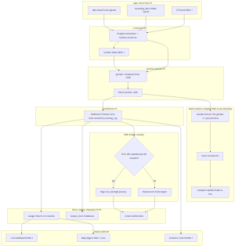
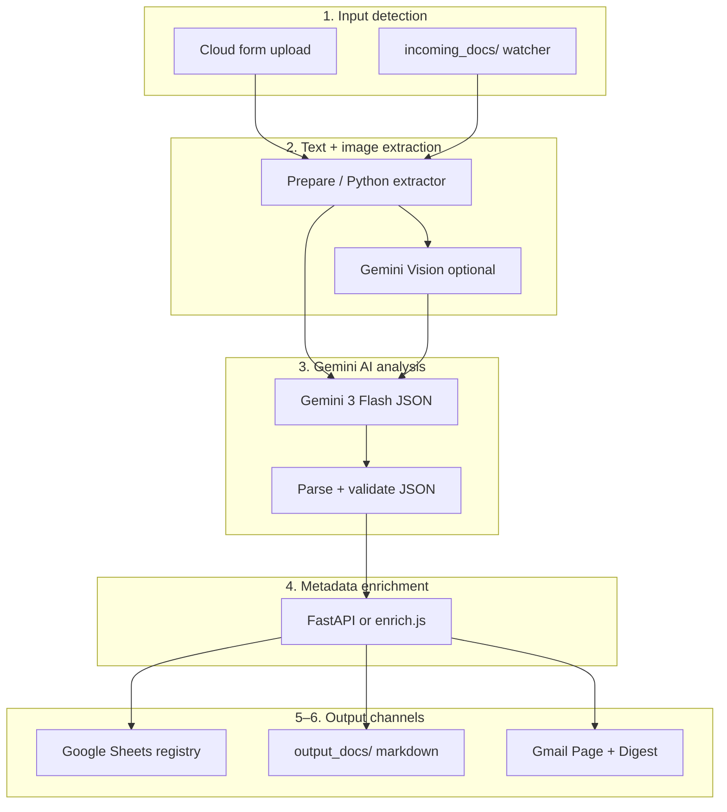

<div align="center">

# HINDSIGHT

### Intelligent Cloud Document Analyst — Cybersecurity Incident Logs

**Enterprise document intelligence pipeline:** n8n · Google Gemini 3 Flash · FastAPI · Google Sheets · Gmail · Supabase pgvector

[](#verification)
[](#technology-stack)
[](#deployment-paths)

[Architecture](#architecture) · [Quick start](#quick-start) · [Course mapping](#course-requirement-mapping) · [Bonus challenges](#bonus-challenges) · [Docs](#documentation)

</div>

---

## Project summary

HINDSIGHT implements the **Cybersecurity incident logs** scenario from the n8n **Intelligent Cloud Document Analyst** course. Students upload SIEM exports, vulnerability scans, phishing reports, or intrusion writeups; **Gemini extracts** structured JSON; a **deterministic enrichment service** re-scores severity (CVSS floor), classifies sensitivity, assigns routing tags, and files results to **Google Sheets** plus **HTML Gmail** notifications.

> **Core principle:** the LLM extracts; the service decides.  
> CVSS 9.8 on a Nessus report floors to **SEV1** and `routing_tag=escalate` even when the author typed SEV3.

This mirrors real enterprise Document Intelligence systems used in SecOps, legal, finance, and HR — cloud AI APIs processing documents daily with OAuth, rate limits, retries, and structured JSON contracts.

---

## Architecture



<details>
<summary>Mermaid — full pipeline (click to expand)</summary>



</details>

| Layer | Component | Role |
|---|---|---|
| Orchestration | **n8n** (Cloud + Docker) | Workflow engine — form trigger, HTTP, Sheets, Gmail |
| AI | **Google Gemini 3 Flash** | Structured JSON extraction; Vision for embedded charts |
| Microservice | **FastAPI enrichment API** | Deterministic severity, sensitivity, routing, search |
| Results DB | **Google Sheets** | One row per document (`Incidents` tab) |
| Notifications | **Gmail OAuth2** | Per-document email + SEV1 page + daily digest |
| Search | **Supabase pgvector** | Semantic search (BON-5) |
| Dashboard | **`dashboard/index.html`** | Live stats from published Sheet CSV |

Deep dive: [`docs/architecture.md`](docs/architecture.md) · source: [`docs/architecture.mmd`](docs/architecture.mmd)

---

## Technology stack

| Area | Technology |
|---|---|
| AI model | Google Gemini 3 Flash (`gemini-3-flash-preview`) + Vision |
| Automation | n8n 1.x (Cloud grading + self-hosted Docker) |
| Microservice | Python 3.12, FastAPI, Pydantic v2 |
| Cloud storage | Google Sheets API (n8n OAuth2 node) |
| Notifications | Gmail (n8n OAuth2 node) |
| File parsing | PyMuPDF, python-docx, plain text |
| Vector search | Supabase pgvector (Pinecone noted as alternative) |
| Auth | Gemini API key (n8n credentials + `.env` for API/scripts) |

---

## Deployment paths

| Path | Trigger | Enrichment | Best for |
|---|---|---|---|
| **n8n Cloud** | [Production form](https://reemmor.app.n8n.cloud/form/21593841-f8b8-43a2-88a8-8595ad3e2f39) | Inline `enrich.js` | Grading / demo |
| **Docker self-hosted** | `incoming_docs/` folder | FastAPI `/enrich` | Vision, DOCX, full pipeline |

### n8n Cloud (grading)

| Item | Value |
|---|---|
| Instance | https://reemmor.app.n8n.cloud |
| Workflow | `HINDSIGHT — Postmortem Intelligence (Cloud)` · `aYEv22StywIPL3Rq` |
| Digest workflow | `HINDSIGHT — Daily Digest (Cloud)` · `L46dvnaJbKGvkCxH` |
| Registry sheet | `1Z7tiPISHB5siYby_lQnWA9wtXbDXVSGTu4HGZ5Dk2tk` · tab `Incidents` |
| Code nodes | `n8n/cloud/nodes/*.js` → sync via `scripts/sync_n8n_cloud_nodes.py` |

### Docker self-hosted

```powershell
copy .env.example .env          # fill GEMINI_API_KEY, SUPABASE_*, N8N_* 
docker compose up --build -d    # enrichment :8000 · n8n :5678

.\.venv\Scripts\python.exe scripts\import_selfhosted_workflow.py
.\.venv\Scripts\python.exe scripts\docker_smoke_test.py
```

Compose reads **`env_file: .env`** for `GEMINI_API_KEY`, Supabase keys, and HINDSIGHT tuning vars. OAuth for Sheets/Gmail is configured inside n8n UI after first login — see [`n8n/SETUP.md`](n8n/SETUP.md).

Drop files into `incoming_docs/` (or use `samples/`). Output markdown lands in `output_docs/`.

---

## Quick start

```powershell
# 1. Environment
copy .env.example .env
.\.venv\Scripts\python.exe -m pip install -r services\enrichment-api\requirements.txt
.\.venv\Scripts\python.exe -m pip install pymupdf pdfplumber python-docx

# 2. Run tests (CI parity)
.\.venv\Scripts\python.exe -m pytest services\enrichment-api -q
.\.venv\Scripts\python.exe -m pytest tests\test_extractor.py -q
node n8n\cloud\tests\test_node_bodies.mjs
node n8n\cloud\tests\test_prepare.mjs
node n8n\cloud\tests\test_compose.mjs
node n8n\cloud\tests\test_bonus_nodes.mjs

# 3. Local API
cd services\enrichment-api
..\..\.venv\Scripts\python.exe -m uvicorn app.main:app --reload --port 8000
# → http://localhost:8000/docs

# 4. Full verification (Cloud + bonuses + Docker)
.\.venv\Scripts\python.exe scripts\verify_all_bonuses.py
.\.venv\Scripts\python.exe scripts\docker_smoke_test.py
```

---

## FastAPI enrichment API

| Endpoint | Method | Purpose |
|---|---|---|
| `/enrich` | POST | Core enrichment — severity floor, sensitivity, routing |
| `/health` | GET | Health probe `{"status":"ok"}` |
| `/categories` | GET | SecOps service catalog |
| `/sensitivity` | POST | Standalone sensitivity classification |
| `/search` | POST | Semantic search (BON-5) |
| `/index` | POST | Index document embedding |
| `/compare` | POST | Flash vs Pro extraction diff (BON-6) |
| `/digest/preview` | POST | Daily digest HTML preview (BON-2) |
| `/metrics` | GET | Prometheus-style counters |

Catalog: `services/enrichment-api/data/service_catalog.yaml`

---

## Bonus challenges

All eight course bonus challenges are implemented and verified:

| # | Challenge | Implementation | Verify |
|---|---|---|---|
| BON-1 | Gemini Vision | `extractors/extract_document.py` + Vision branch | `tests/test_extractor.py` |
| BON-2 | Daily email digest | `digest_workflow.json` + `digest_aggregate.js` | `test_digest.py`, Cloud wf active |
| BON-3 | Live dashboard | [`dashboard/index.html`](dashboard/index.html) · `?csv=` | `docs/screenshot-dashboard.png` |
| BON-4 | Retry logic | Gemini 5× / 3 s backoff | `audit_n8n_cloud.py` |
| BON-5 | Semantic search | Supabase pgvector + `/search` `/index` | `test_search.py`, `run_live_search_test.py` |
| BON-6 | Multi-model compare | `/compare` + `compare_models.js` | `test_compare.py` |
| BON-7 | Multi-file batch | `.zip` fan-out in `prepare.js` | `test_batch.py` |
| BON-8 | Sensitivity alerting | SEV1 / confidential / escalate → Page On-Call | `patch_cloud_workflow.py` |

Details: [`docs/bonus-challenges.md`](docs/bonus-challenges.md)

---

## Course requirement mapping

| Course § | Requirement | HINDSIGHT implementation |
|---|---|---|
| §3 | Architecture | [`docs/architecture.md`](docs/architecture.md), dual Cloud/Docker paths |
| §4 | Pipeline steps 1–6 | Form/watch → extract → Gemini → enrich → Sheets → email |
| §5 | Gemini API | `prepare.js`, `gemini-3-flash-preview`, JSON mode, retries |
| §6 | Metadata API | `services/enrichment-api/` — all required endpoints |
| §7 | Google Sheets | 14-column `Incidents` tab, flatten node, compose row |
| §8 | Gmail notification | Professional HTML in `compose.js` |
| §9 | Bonus challenges | All 8 — see table above |
| §10 | Scenario | Cybersecurity incident logs (SIEM, vuln, phishing, intrusion) |

Full traceability: [`docs/traceability-matrix.md`](docs/traceability-matrix.md) · [`docs/ASSIGNMENT-MAP.md`](docs/ASSIGNMENT-MAP.md)

---

## Verification

```powershell
# One-shot: all bonuses + workflow activation
.\.venv\Scripts\python.exe scripts\verify_all_bonuses.py

# Docker stack after compose up
.\.venv\Scripts\python.exe scripts\docker_smoke_test.py

# Cloud read-only audit
.\.venv\Scripts\python.exe scripts\audit_n8n_cloud.py

# Screenshots (dashboard, FastAPI, n8n local)
node scripts\capture_screenshots.mjs

# Cloud form E2E (requires N8N_API_KEY in .env)
node scripts\e2e_cloud_form.mjs
```

**CI** (`.github/workflows/test.yml`): pytest · ruff · node-body tests · optional Cloud audit.

---

## Screenshots & evidence

| Artifact | Path |
|---|---|
| Architecture diagram | [`docs/architecture.png`](docs/architecture.png) |
| n8n workflow canvas | [`docs/screenshot-workflow.png`](docs/screenshot-workflow.png) |
| Cloud form | [`docs/screenshot-form-cloud.png`](docs/screenshot-form-cloud.png) |
| Form success | [`docs/screenshot-form-success.png`](docs/screenshot-form-success.png) |
| Execution detail | [`docs/screenshot-execution.png`](docs/screenshot-execution.png) |
| Google Sheet row | [`docs/screenshot-sheet.png`](docs/screenshot-sheet.png) |
| Gmail notification | [`docs/screenshot-email.png`](docs/screenshot-email.png) |
| Live dashboard | [`docs/screenshot-dashboard.png`](docs/screenshot-dashboard.png) |
| FastAPI OpenAPI | [`docs/screenshot-fastapi.png`](docs/screenshot-fastapi.png) |
| Local n8n | [`docs/screenshot-n8n-local.png`](docs/screenshot-n8n-local.png) |

Evidence index: [`docs/VALIDATION.md`](docs/VALIDATION.md)

---

## Developer tooling

### MCP servers (Cursor)

Configured in [`.cursor/mcp.json`](.cursor/mcp.json) — secrets via `${env:...}` interpolation only:

| Server | Purpose |
|---|---|
| `n8n-workflows` | Live workflow inspection via n8n MCP |
| `playwright` | E2E form submit, dashboard capture |
| `context7` | Up-to-date library documentation |
| `supabase` (plugin) | pgvector schema / BON-5 ops |

Security rule: [`.cursor/rules/secrets-and-mcp-security.mdc`](.cursor/rules/secrets-and-mcp-security.mdc)

### Agent brief

[`AGENTS.md`](AGENTS.md) — single source of truth for AI coding agents (Cursor + Claude Code via [`CLAUDE.md`](CLAUDE.md)).

### Key scripts

| Script | Role |
|---|---|
| `sync_n8n_cloud_nodes.py` | Push Code nodes to live Cloud workflow |
| `patch_cloud_workflow.py` | BON-4/7/8 patches, form copy, Gemini model URL |
| `verify_all_bonuses.py` | 10-check bonus + activation verifier |
| `docker_smoke_test.py` | Post-compose health + enrich smoke |
| `import_selfhosted_workflow.py` | Import workflow into Docker n8n |
| `capture_screenshots.mjs` | Regenerate docs screenshots |
| `render_architecture.mjs` | Re-render `architecture.png` from `.mmd` |

---

## Repo map

| Path | Role |
|---|---|
| `n8n/cloud/nodes/` | **Source of truth** for Cloud Code-node bodies |
| `n8n/hindsight_workflow.json` | Self-hosted workflow import |
| `services/enrichment-api/` | Graded FastAPI brain |
| `extractors/extract_document.py` | PDF/DOCX/text + embedded images |
| `prompts/` | Gemini extraction + vision prompt templates |
| `dashboard/` | Live HTML/JS dashboard (Chart.js) |
| `samples/` | Cyber incident fixtures + batch ZIP |
| `migrations/` | Supabase pgvector schema |
| `docs/` | Setup guide, validation, architecture, matrices |

---

## Google Sheets columns (§7.2)

```
document_id | filename | file_type | processed_at | classification | department |
sentiment | confidence_score | summary | routing_tag | sensitivity | action_items |
cvss_score | cve_ids
```

Bootstrap headers: `.\.venv\Scripts\python.exe scripts\bootstrap_incidents_tab.py`

---

## Prompts

| File | Used by |
|---|---|
| [`prompts/extraction_prompt.md`](prompts/extraction_prompt.md) | Gemini — Extract Incident (ROLE/TASK/OUTPUT/RULES) |
| [`prompts/vision_prompt.md`](prompts/vision_prompt.md) | Gemini Vision branch (embedded PDF charts) |

Live prompt body: `n8n/cloud/nodes/prepare.js` → synced to Cloud.

---

## Documentation

| Doc | Contents |
|---|---|
| [`docs/SETUP-GUIDE.md`](docs/SETUP-GUIDE.md) | Manual checklist — credentials, sheet, form URL |
| [`n8n/SETUP.md`](n8n/SETUP.md) | Self-hosted n8n import + Docker paths |
| [`docs/edge-case-matrix.md`](docs/edge-case-matrix.md) | Edge cases + parity notes |
| [`docs/bonus-challenges.md`](docs/bonus-challenges.md) | All 8 bonuses with diagrams |
| [`docs/VALIDATION.md`](docs/VALIDATION.md) | Test counts + screenshot index |

---

## License

See [`LICENSE`](LICENSE).
