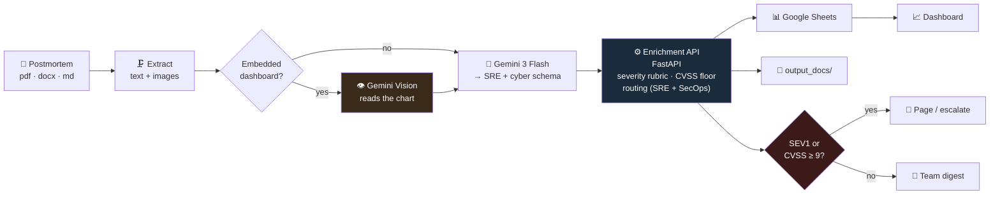
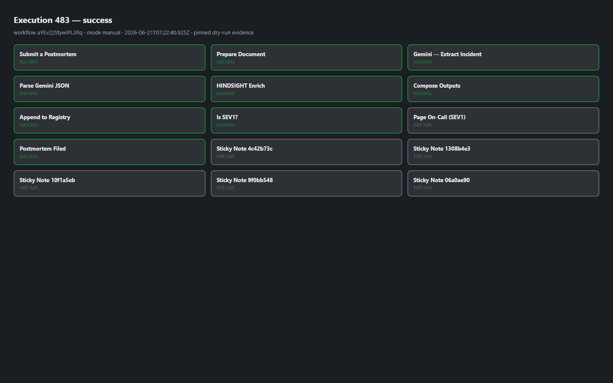
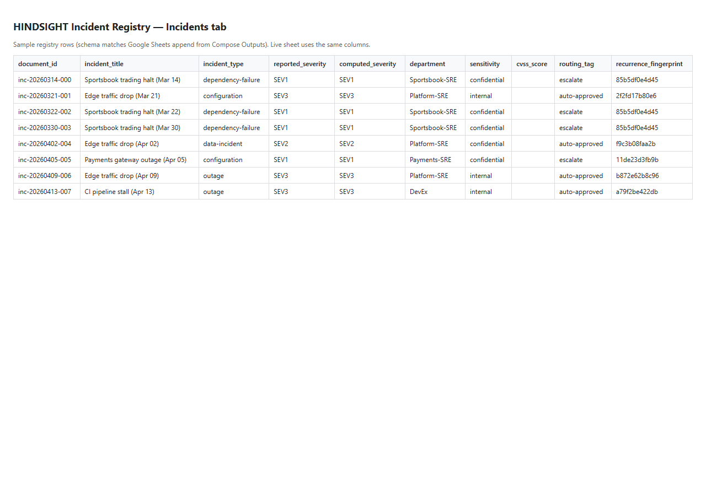
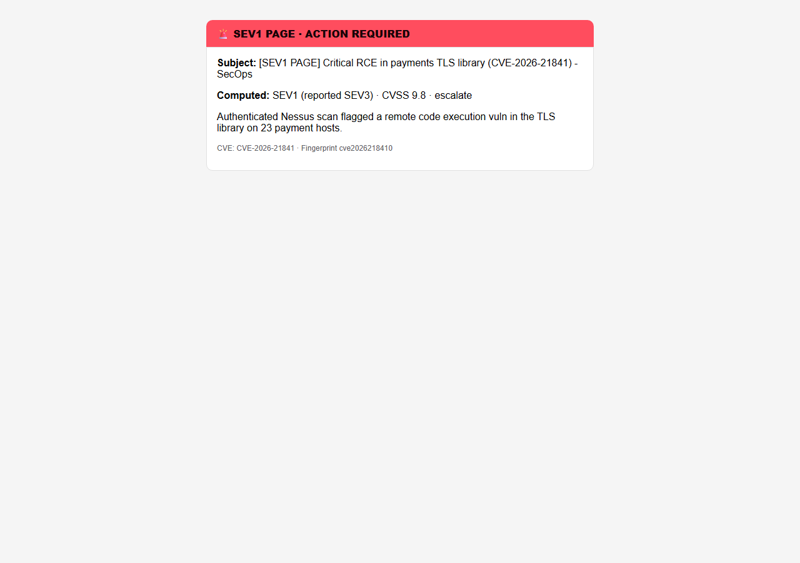
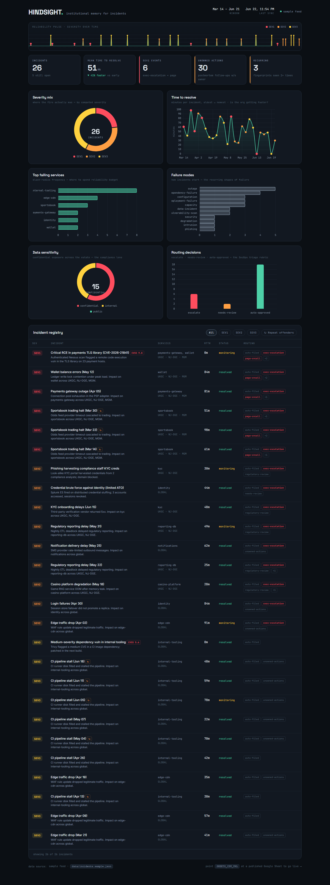
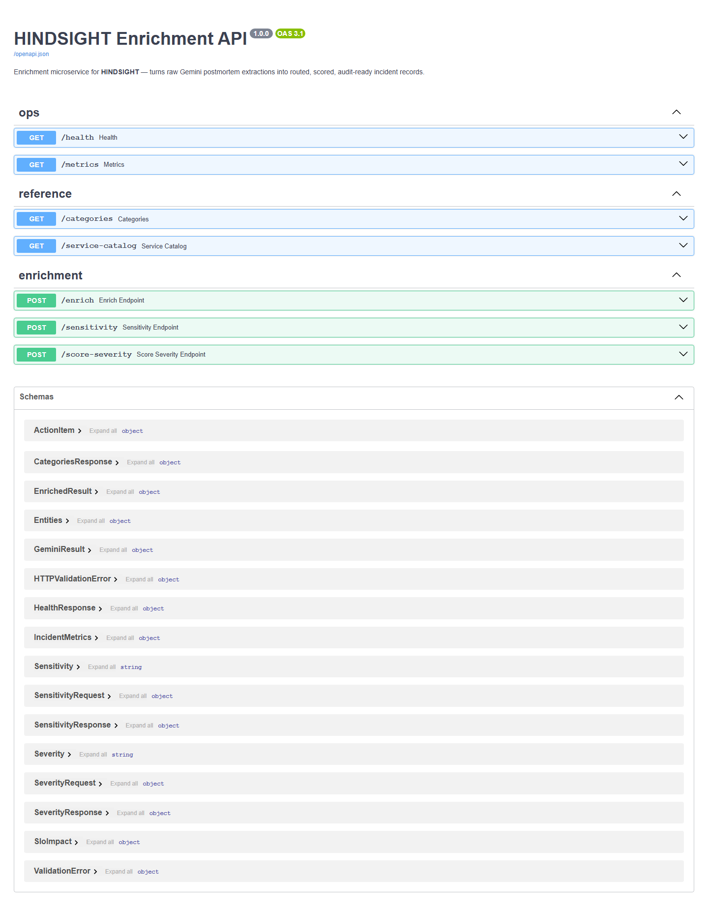

<div align="center">

# HINDSIGHT

### Institutional memory for incidents

**An AI pipeline that turns SRE postmortems and security findings into a structured, routed, queryable reliability & risk record.**

`n8n` · `Gemini 3 Flash (+ Vision)` · `FastAPI` · `Google Sheets` · `Gmail`

[](https://github.com/reem-mor/hindsight/actions/workflows/test.yml)
[](LICENSE)

</div>

---

## Why this exists

When an incident ends, the postmortem gets written, skimmed once in a review, and filed in a
doc folder. Weeks later the same failure mode recurs and nobody connects the two. The
organisation *wrote down* the memory — it just has no way to **use** it. Action items go
unowned, severity is whatever the author typed at 2 a.m., and "have we seen this before?" is
answered from human recall.

HINDSIGHT applies the same discipline to every postmortem automatically: re-score the
severity against a rubric, route it to the team that owns the affected service, compute how
much error budget it burned, and fingerprint it so recurrence is detected on its own.

> **PITER fights the fire in real time. HINDSIGHT makes sure it never burns the same way twice.**
>
> This is the retrospective half of a reliability portfolio — [PITER](https://github.com/reem-mor)
> is the real-time incident-response platform; HINDSIGHT is the institutional memory that learns
> from every incident after it closes.

This is the *Intelligent Cloud Document Analyst* assignment, built for the domain I actually
work in — regulated, multi-jurisdiction (UKGC / NJ-DGE / MGM) production reliability **and
security operations**. The scenario is **hybrid**: it reads SRE postmortems *and* cyber
artifacts (SIEM exports, vulnerability scans, phishing/intrusion writeups), routing security
findings to **SecOps** and flooring severity on **CVSS** (a CVSS 9.8 CVE is a SEV1 page, no
matter what the author typed).

---

## What it does, end to end



A postmortem lands in `incoming_docs/`. n8n extracts its text and any embedded dashboard
screenshots. **Gemini Vision** reads the charts (peak error rate, anomaly window); **Gemini 3
Flash** turns the document into a structured SRE schema. The **enrichment microservice** then
does the part a language model can't: it re-scores severity, routes to the owning team, computes
error-budget burn, and fingerprints the incident for recurrence. Results append to a Google
Sheets registry, a rendered summary is written to disk, SEV1s page on-call immediately, and a
[Reliability Intelligence dashboard](dashboard/index.html) reads the registry.

---

## The idea that makes it more than a summariser

A text-only LLM can summarise a postmortem. It **cannot** know that `payments-gateway` is a
99.95%-SLO service owned by Payments-SRE operating under three regulators, or that 69 minutes
of downtime is a 319% error-budget breach. That is *organisational* knowledge, and it belongs
in a deterministic service you own and can test — not in a prompt.

**The LLM extracts; the service decides.** Here is a real enrichment response — note that a
postmortem the author marked **SEV2** is corrected to **SEV1**:

```jsonc
// POST /enrich  ·  input: severity "SEV2", services ["payments-gateway","wallet"]
{
  "reported_severity":  "SEV2",
  "computed_severity":  "SEV1",        // ← rubric overrode the author
  "severity_score":     9,
  "severity_review_needed": true,
  "department":         "Payments-SRE",  // routed from the service catalog
  "affected_jurisdictions": ["MGM", "NJ-DGE", "UKGC"],  // catalog expanded these
  "sensitivity":        "confidential",
  "slo_impact": {
    "slo_target":           99.95,
    "monthly_budget_minutes": 21.6,
    "budget_burn_minutes":    69.0,
    "budget_burn_pct":        319.4,   // burned 3× the monthly budget
    "budget_breach":          true
  },
  "recurrence_fingerprint": "8bf8edee8c30",
  "routing_tags": ["auto-filed","exec-escalation","page-oncall",
                   "regulatory-review","severity-review","unowned-actions","budget-breach"]
}
```

Each decision is deterministic and unit-tested:

- **Severity is computed, not trusted** — a rubric scores service tier × jurisdiction breadth ×
  impact language × downtime. Disagree with the author by a band → `severity-review`.
- **Routing from a catalog** — `service_catalog.yaml` maps 12 services → team, tier, SLO,
  jurisdictions, with alias matching so "payment-gw" and "payments" resolve to one owner.
- **Error-budget burn** — each service's SLO turns minutes of downtime into a budget % an
  org actually plans with.
- **Recurrence is detected** — a fingerprint over type + services + root-cause keywords makes
  "seen this before?" automatic; repeat offenders surface on the dashboard.
- **Action items are gated** — follow-ups without an owner are flagged `unowned-actions`;
  postmortems that name-and-blame individuals get `blameless-coaching`.

See [`docs/architecture.md`](docs/architecture.md) for the full design.

---

## Quick start

```bash
# 1. Run the enrichment microservice + a Python-capable n8n
docker compose up --build
#    n8n        → http://localhost:5678
#    enrichment → http://localhost:8000   (try GET /health, /metrics, /categories)

# 2. Import the workflow
#    n8n → Workflows → Import from File → n8n/hindsight_workflow.json
#    then attach 3 credentials (Gemini key, Google Sheets, Gmail) — see n8n/SETUP.md

# 3. Watch a run end-to-end
cp samples/payments_sev1_checkout_outage.md incoming_docs/   # a SEV1 → fires the paging branch
cp samples/vuln_scan_critical_openssl.md incoming_docs/      # CVSS 9.8 CVE → SecOps, escalate, page
```

**Generate the Vision-branch PDF** (a vuln scan with an embedded severity chart):
```bash
pip install matplotlib reportlab
python samples/make_cyber_pdf_sample.py        # → samples/vuln_scan_sev1_critical_rce.pdf
```

**Just want to see the output?** Open [`dashboard/index.html`](dashboard/index.html) in a
browser — it ships with a bundled sample registry and needs no backend.

**Run the service on its own:**
```bash
cd services/enrichment-api
pip install -r requirements.txt
uvicorn app.main:app --reload      # http://localhost:8000/docs
pytest -q                          # 32 tests
```

---

## The Gemini schema

Gemini 3 Flash is prompted (`prompts/extraction_prompt.md`) to return **only** JSON in this
shape — far richer than a generic summary because the enrichment downstream depends on it:

```jsonc
{
  "incident_title": "...", "summary": "...",
  "severity": "SEV1|SEV2|SEV3|SEV4",
  "incident_type": "outage|degradation|...|vulnerability-scan|malware|phishing|intrusion|ddos",
  "status": "resolved|monitoring|...",
  "affected_services": [...], "affected_jurisdictions": [...],
  "root_cause": "...", "trigger": "...", "detection_method": "...",
  "entities": { "people": [], "teams": [], "systems": [], "dates": [], "error_codes": [] },
  "action_items": [ { "action": "...", "owner": "...", "priority": "high|medium|low" } ],
  "contributing_factors": [...], "sentiment": "...",
  "blameless_quality": "good|fair|poor", "confidence_score": 0.0,
  "cvss_score": 9.8, "cve_ids": ["CVE-2026-21841"],   // cyber: scored vulns floor severity
  "metrics": { "detected_at": "...", "resolved_at": "...",
               "ttd_minutes": 0, "ttr_minutes": 0, "customer_impact": "..." }
}
```

The prompt instructs Gemini to pick the **lower** severity when unsure, because the rubric
re-scores it — keeping the model conservative and the decision in code.

---

## Enrichment API reference

FastAPI · OpenAPI docs at `/docs` · all four required endpoints plus enterprise extras.

| Method | Endpoint | Purpose |
|---|---|---|
| `POST` | `/enrich` | Gemini JSON → fully enriched incident record |
| `GET` | `/health` | `{"status":"ok", version, uptime, catalog_services}` |
| `GET` | `/categories` | Valid severities, incident types, sensitivities, teams |
| `POST` | `/sensitivity` | Classify public / internal / confidential |
| `POST` | `/score-severity` | Run the severity rubric standalone |
| `GET` | `/service-catalog` | The full service → team/SLO/jurisdiction map |
| `GET` | `/metrics` | Prometheus exposition — the tool observes itself |

---

## The dashboard

[`dashboard/index.html`](dashboard/index.html) — a control-room "Reliability Intelligence"
view. Severity is a colour language (SEV1 hot red → SEV4 cool teal); the signature **reliability
pulse** plots every incident as a severity-coloured spike on a timeline. KPIs (incidents, MTTR
trend, SEV1 count, unowned actions, recurring), four charts (severity mix, time-to-resolve trend,
top failing services, failure modes), and a filterable registry with a one-click **repeat
offenders** filter.

It reads a published Google Sheets CSV if you set `SHEETS_CSV_URL`, otherwise the bundled sample
— so it's live when wired up and demoable when not.

---

## Running live on n8n Cloud

> Beyond the local Docker build, HINDSIGHT is also deployed live to an **n8n Cloud** instance
> (which has no local filesystem or Execute Command). Details: [`n8n/cloud/README.md`](n8n/cloud/README.md).

- **Workflow:** `HINDSIGHT — Postmortem Intelligence (Cloud)` — 15 nodes, deployed as a draft.
- **Source:** `n8n/cloud/workflow.ts` (n8n Workflow SDK); the four Code-node bodies live in `n8n/cloud/nodes/`.
- Two upgrades over the local build: PDFs are read by **Gemini Vision natively** (`inline_data`,
  embedded charts and all), and the enrichment brain runs **in-process** in a Code node, so the
  workflow needs **zero extra infrastructure** to run end to end.

---

## Testing & validation

**112 automated checks, all green** — pytest, Cloud node bodies, and n8n API smoke.

| Suite | Checks | Run it |
|---|---:|---|
| FastAPI enrichment (`pytest`) | 48 | `cd services/enrichment-api && pytest -q` |
| Deployed Cloud Code nodes (`node`) | 61 | `node n8n/cloud/tests/test_node_bodies.mjs` |
| Live n8n Cloud dry-runs (both routing branches) | 2 | executions `481`, `483` (previously deployed; see note) |

> **Honest status note.** The 48 pytest + 61 node checks were re-run and verified in this
> build (Python 3.12 venv; Node 24). The two live n8n Cloud dry-runs were validated in an
> earlier session — **this build had no n8n MCP connected, so they were not re-verified here.**
> The local `docker compose` stack (enrichment + Python-capable n8n) *was* rebuilt and run end
> to end: enrichment `/health` healthy, n8n `200 /healthz`, and the Python extractor confirmed
> inside the n8n container.

Coverage spans the severity rubric (upgrade *and* downgrade both flag review), routing
fallbacks, jurisdiction logic, data sensitivity, SLO error-budget boundaries, recurrence-
fingerprint determinism, confidence flooring, and every guardrail (fenced / malformed model
output, missing file, empty payload, large unicode input). The full evidence trail — plus the
n8n template-literal *cooking* fix that keeps the deployed regexes byte-for-byte intact — is in
[`docs/VALIDATION.md`](docs/VALIDATION.md).

---

## Repository layout

```
hindsight/
├── services/enrichment-api/   # FastAPI microservice + 32 pytest tests
│   ├── app/                    # config, models, routing, severity, enrichment, main
│   ├── data/service_catalog.yaml
│   └── tests/                  # incl. test_edge_cases.py (adversarial + guardrails)
├── extractors/                # text + embedded-image extractor (pdf/docx/md)
├── prompts/                   # Gemini extraction + Vision prompts
├── n8n/                       # importable workflow JSON + SETUP.md + Dockerfile
│   └── cloud/                  # LIVE n8n Cloud build: workflow.ts, nodes/, 46-test harness
├── dashboard/                 # the Reliability Intelligence dashboard (+ sample data)
├── samples/                   # postmortems incl. a PDF with an embedded chart
├── docs/                       # architecture.md, VALIDATION.md, sessions/
└── docker-compose.yml
```

---

## Mapping to the assignment

Every requirement, plus most of the bonus track:

| Requirement | Where |
|---|---|
| Multi-node n8n workflow | `n8n/hindsight_workflow.json` (18 nodes) |
| Gemini 3 Flash, structured JSON | `🧠 Gemini` node + `prompts/extraction_prompt.md` |
| Python enrichment microservice | `services/enrichment-api/` (FastAPI) |
| `/enrich` `/health` `/categories` `/sensitivity` | all present, + 3 extra endpoints |
| `routing_tag` (escalate / needs-review / auto-approved) | `EnrichedResult.routing_tag` (single-value rubric) |
| Google Sheets results DB | `📊 Append to registry` node |
| Gmail notifications | `🚨 Page` + `📧 Digest` nodes |
| Error handling, retries, logging | retry policy on Gemini nodes; structured JSON logs + correlation id |
| **Cyber hybrid — CVSS + SecOps** | CVSS severity floor + SecOps routing + SIEM/vuln-scan/phishing/intrusion/ddos categories |
| **Bonus — Gemini Vision** | embedded dashboard charts read by the Vision branch |
| **Bonus — Live dashboard** | `dashboard/index.html` (severity, sensitivity, routing, CVSS) reads Sheets CSV |
| **Bonus — Retry logic** | Gemini nodes: 5 tries, 3 s backoff on 429s |
| **Bonus — Sensitivity alerting** | SEV1 / CVSS≥9 → immediate high-priority page / `escalate` |
| Domain scenario | **Hybrid** — SRE postmortems **+** cyber/SecOps (SIEM, vuln scans, CVSS) |
| Edge-case + traceability matrices | [`docs/edge-case-matrix.md`](docs/edge-case-matrix.md), [`docs/traceability-matrix.md`](docs/traceability-matrix.md) |

> **Environment note:** the Python extractor runs via n8n's Execute Command node, which is
> available on **self-hosted** n8n (the `docker-compose` stack). n8n Cloud disables Execute
> Command — there, swap that node for n8n's native *Extract from File* (text-only; the Vision
> branch needs the self-hosted extractor for embedded images).

---

## Model & live-credential notes (read before grading)

- **Gemini model string.** The assignment specifies `gemini-3-flash`; the workflow uses it
  verbatim. Per current Gemini docs the live API id is `gemini-3-flash-preview` (Gemini 3 is in
  preview), with `gemini-3.5-flash` as the newer Flash. To make live calls, change the model in
  the two HTTP Request nodes — it is a one-line swap and the architecture is identical.
- **What needs your credentials.** Live Gemini calls (your `x-goog-api-key`), Google Sheets
  OAuth2, and Gmail OAuth2 cannot be exercised in this repo — follow `n8n/SETUP.md` to attach
  them. Everything deterministic (the enrichment brain, parsing, routing, CVSS, severity) is
  covered by the 112 automated checks (48 pytest + 61 node + API smoke).
- **n8n validation.** Workflow JSON is validated structurally; the Docker stack runs end to end.
  Live n8n Cloud workflow `aYEv22StywIPL3Rq` is verified via `scripts/verify_n8n_cloud.py` (API)
  and pinned dry-runs `481` / `483`. MCP servers are configured in `.cursor/mcp.json` — see
  [`docs/MCP-SETUP.md`](docs/MCP-SETUP.md).

## Screenshots (grader checklist)

| Evidence | File |
|---|---|
| n8n workflow (Cloud API snapshot) |  |
| Successful execution (pinned dry-run) |  |
| Google Sheet registry schema + rows |  |
| SEV1 page email (CVSS escalate) |  |
| Reliability dashboard |  |
| FastAPI OpenAPI |  |

Regenerate locally:

```bash
node scripts/capture_screenshots.mjs
node scripts/capture_n8n_evidence.mjs      # needs N8N_API_KEY
node scripts/capture_registry_evidence.mjs
```

---

<div align="center">
<sub>Built by Re'em Mor — AI Engineer × SRE — for the Oz VeRuach AI-Augmented Software Engineering course.</sub>
</div>
