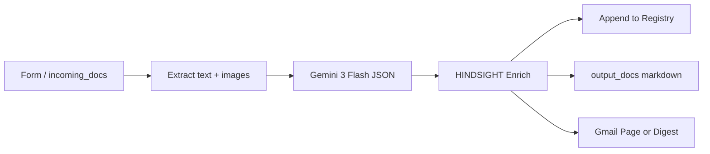
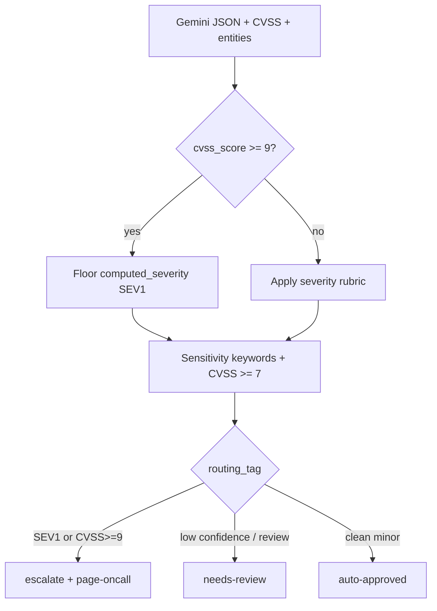
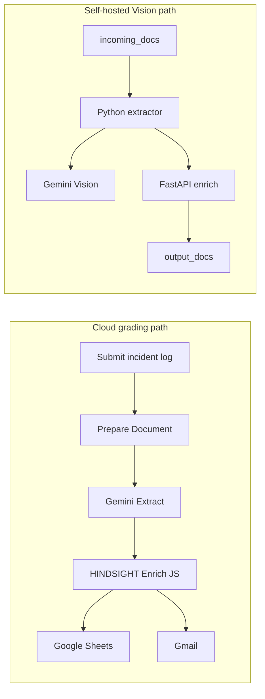
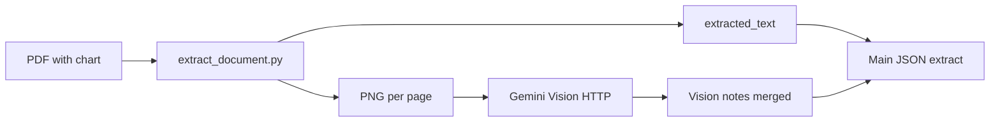
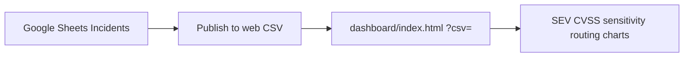
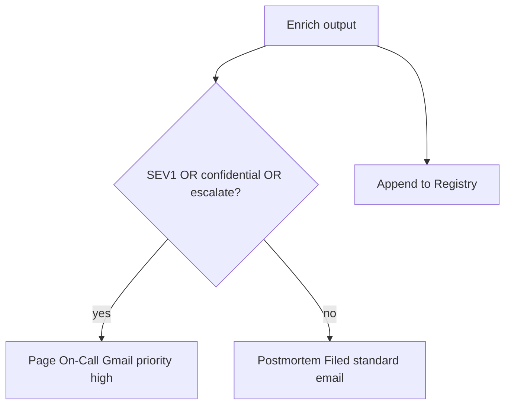
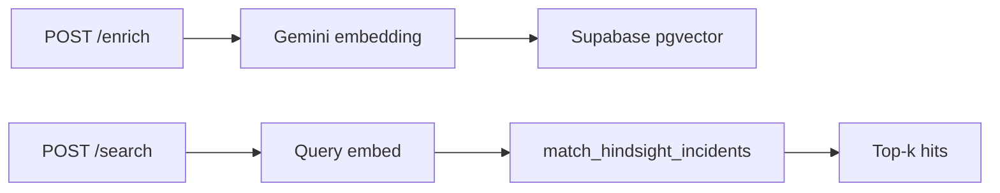
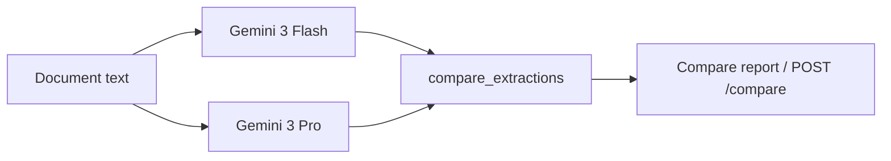
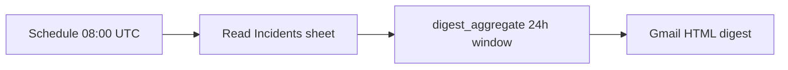
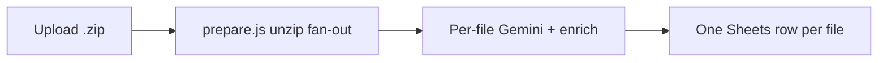

# HINDSIGHT — Architecture

**Contract:** the LLM extracts; the service decides. Gemini returns strict JSON; the enrichment
brain (FastAPI or inline `enrich.js`) applies the CVSS floor, sensitivity keywords, department
routing, and `routing_tag` deterministically.

## Pipeline sequence (DIAG-2 — REQ-P1→P6)

Cloud node names: `Submit a Postmortem` → `Prepare Document` → `Gemini — Extract Incident` →
`Parse Gemini JSON` → `HINDSIGHT Enrich` → `Compose Outputs` → `Flatten for Sheets` /
`Page On-Call (SEV1)` / `Postmortem Filed`.

## Enrichment decision logic (DIAG-3)

## Dual deployment paths

## Bonus data flows (DIAG-4)

### BON-1 Gemini Vision (self-hosted)

### BON-3 Live Dashboard

### BON-8 Sensitivity alerting

See [bonus-challenges.md](bonus-challenges.md) for all eight bonuses, tests, and evidence paths.

### BON-5 Semantic Search

### BON-6 Multi-model Compare

### BON-2 Daily Digest

### BON-7 Multi-file Batch

## Cyber/SecOps hybrid layer

- **CVSS floor:** `>= 9.0 → SEV1`, `>= 7.0 → SEV2`, `>= 4.0 → SEV3` — authoritative over Gemini severity.
- **SecOps routing:** `vulnerability-scan`, `phishing`, `intrusion`, etc. map via `service_catalog.yaml`.
- **Sensitivity:** `public` / `internal` / `confidential` via keyword + CVSS + CVE signals.
- **Alerting (BON-8):** `Is SEV1?` pages on SEV1, `confidential`, or `routing_tag=escalate`.

The Python brain (`services/enrichment-api`) and deployed JavaScript (`n8n/cloud/nodes/enrich.js`)
implement identical logic, verified by parallel test suites.

## Component summary

| Layer | Technology | Responsibility |
|---|---|---|
| Orchestration | n8n Cloud + self-hosted | Triggers, Gemini calls, Sheets, Gmail |
| Extraction | PyMuPDF, python-docx, prepare.js | Text + images; ZIP fan-out |
| Reasoning | Gemini 3 Flash (+ Vision) | Strict JSON extraction |
| Decision | FastAPI / enrich.js | CVSS floor, sensitivity, routing_tag |
| Registry | Google Sheets | One row per document |
| Search | pgvector / in-memory | Semantic incident lookup (BON-5) |
| Insight | dashboard/index.html | Severity, CVSS, sensitivity, routing charts |

Render Figure 1 PNG: `node scripts/render_architecture.mjs`
