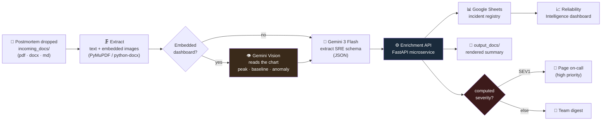
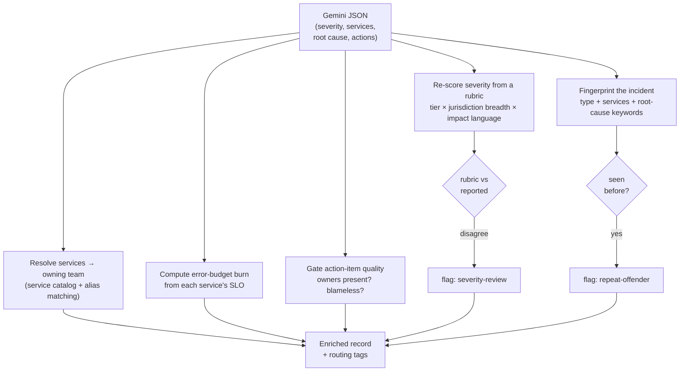

# HINDSIGHT — Architecture

## The problem

When an incident is over, the postmortem gets written, skimmed in a review, and quietly
buried in a doc folder. Six weeks later the same failure mode recurs and nobody connects the
two. The organisation has the memory written down — it just has no way to *use* it. Action
items go unowned, severity is whatever the stressed author typed at 2 a.m., and "have we seen
this before?" is answered from human recall.

HINDSIGHT turns each postmortem from a document into a **structured, queryable record**, and
applies the same rules to every one of them: re-score the severity, route it to the team that
owns the affected service, compute how much error budget it burned, and fingerprint it so
recurrence is detected automatically.

> PITER fights the fire in real time. HINDSIGHT makes sure it never burns the same way twice.

## Pipeline

## Why the enrichment service is the centre of gravity

A text-only LLM can summarise a postmortem. It cannot know that `payments-gateway` is a
99.95%-SLO service owned by Payments-SRE that operates under UKGC, NJ-DGE *and* MGM, or that
69 minutes of downtime is a 319% error-budget breach. That is **organisational** knowledge,
and it belongs in a deterministic service you own and can test — not in a prompt.

The LLM extracts; the service decides. Concretely, for every incident the service:

### Severity is computed, not trusted
A rubric scores each incident from the **service tier** (critical → standard), the **breadth
of jurisdictions** touched (a multi-regulator incident scores higher), **impact language** in
the text (data loss, funds, breach, payment-down…), and **downtime**. The score maps to a
band; if it disagrees with the reported severity by a band or more, the incident is tagged
`severity-review`. In the worked example, a postmortem the author marked **SEV2** scores **9
→ SEV1**, because it hit a critical payments service across three jurisdictions.

### Routing comes from a service catalog, not the model
`data/service_catalog.yaml` maps 12 services to their team, tier, SLO, jurisdictions, and
aliases. "payments gateway", "payment-gw", and "payments" all resolve to the same owner. This
is the single source of truth a real org would keep in version control.

### Error-budget burn makes severity quantitative
Each service carries an SLO. A 99.95% monthly target is ~21.6 minutes of budget; a 69-minute
incident burns **319%** of it → `budget-breach`. This is the language reliability orgs
actually plan with.

### Recurrence is detected, not remembered
A fingerprint (`sha1` of incident type + sorted services + root-cause keywords) makes "have we
seen this?" automatic. The Sheets registry is the durable store of fingerprints; the dashboard
surfaces repeat offenders so chronic failure modes get prioritised.

## Observability of the tool itself
The enrichment service is self-observable: structured JSON logs with a **correlation id** that
is minted at extraction time and threaded through Gemini → enrich → Sheets, plus a Prometheus
`/metrics` endpoint. The tool that watches reliability is held to the same standard.

## Component summary

| Layer | Technology | Responsibility |
|---|---|---|
| Orchestration | n8n (self-hosted) | Watch folder, call Gemini, call the API, write Sheets + Gmail |
| Extraction | PyMuPDF, python-docx | Text **and** embedded dashboard images out of pdf/docx/md |
| Reasoning | Gemini 3 Flash (+ Vision) | Postmortem → structured SRE schema; charts → metrics |
| Decision | FastAPI microservice | Severity rubric, routing, SLO burn, recurrence, gating |
| Registry | Google Sheets | Durable incident record + fingerprint store |
| Notification | Gmail | SEV1 page; team digest otherwise |
| Insight | HTML/Chart.js dashboard | Severity mix, MTTR trend, failing services, repeat offenders |
