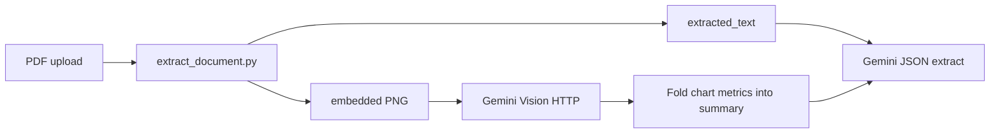
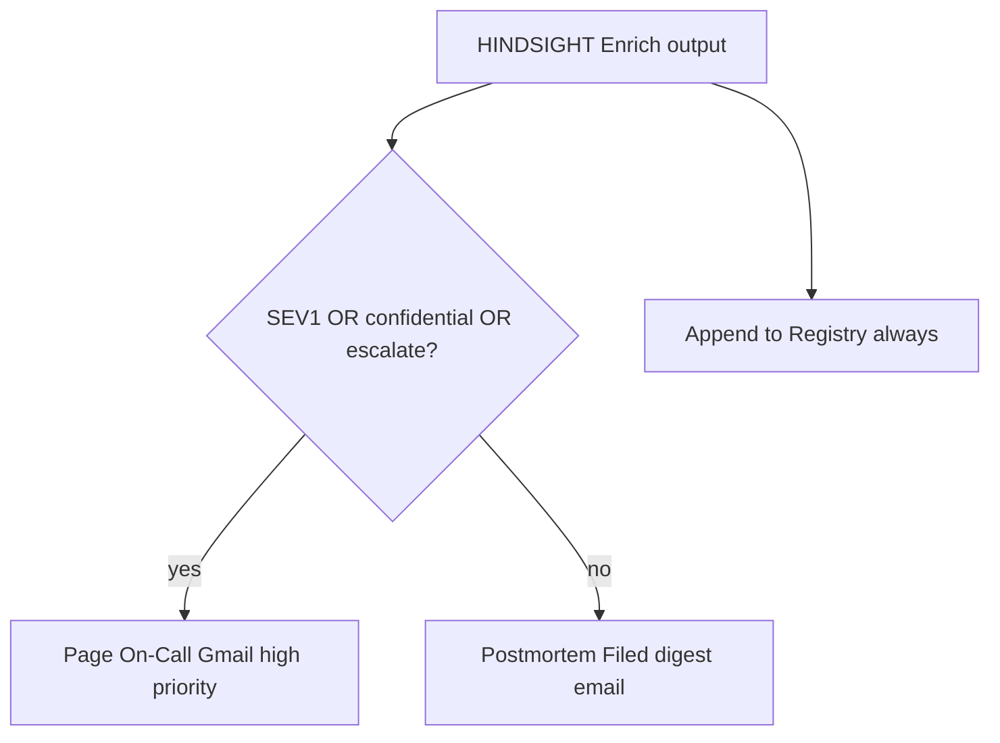

# HINDSIGHT — Bonus challenges (all 8)

Maps course brief §9 to implementation, architecture, tests, and evidence.

| ID | Challenge | Implementation | Architecture | Automated proof | Live evidence |
|---|---|---|---|---|---|
| BON-1 | Gemini Vision | Self-hosted Vision HTTP node; Cloud PDF `inline_data` in `prepare.js` | [architecture.md](architecture.md) § BON-1 | `test_extractor.py` (PDF + image) | `samples/vuln_scan_sev1_critical_rce.pdf` |
| BON-2 | Daily Email Digest | `digest_workflow.json` + `digest_aggregate.js` (24h window) | [architecture.md](architecture.md) § BON-2 | `test_digest.py`, `test_bonus_nodes.mjs` | Import digest workflow; cron 08:00 UTC |
| BON-3 | Live Dashboard | `dashboard/index.html` + `?csv=` published Sheet URL | [architecture.md](architecture.md) § BON-3 | fixture CSV server in tests | 📸 `screenshot-dashboard.png` |
| BON-4 | Retry logic | Gemini HTTP `retryOnFail` 5× / 3s | workflow config | `audit_n8n_cloud.py` | audit row OK |
| BON-5 | Semantic Search | Supabase pgvector + `POST /search`, `/index` | [architecture.md](architecture.md) § BON-5 | `test_search.py` | `migrations/001_pgvector_incidents.sql` |
| BON-6 | Multi-model Compare | `POST /compare` (Flash vs Pro); `compare_models.js` | [architecture.md](architecture.md) § BON-6 | `test_compare.py`, bonus node test | API-only (not main Cloud workflow) |
| BON-7 | Multi-file Batch | `prepare.js` ZIP fan-out (max 25); `batch.py` API | [architecture.md](architecture.md) § BON-7 | `test_batch.py`, `test_prepare.mjs` | `samples/batch_incidents.zip` |
| BON-8 | Sensitivity Alerting | `Is SEV1?` OR confidential OR escalate → Page On-Call | [architecture.md](architecture.md) § BON-8 | `patch_cloud_workflow.py`, self-hosted `build_workflow.py` | exec 507 Page On-Call |

## BON-1 — Vision path



Cloud grading path sends PDF bytes via `inline_data` without Execute Command (n8n Cloud limitation).

## BON-8 — Alert routing



## Commands

```powershell
node scripts\render_architecture.mjs
node scripts\capture_screenshots.mjs
.\.venv\Scripts\python.exe scripts\build_digest_workflow.py
.\.venv\Scripts\python.exe scripts\patch_cloud_workflow.py
```
